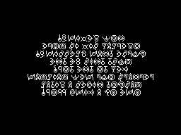
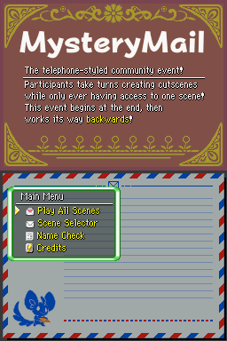
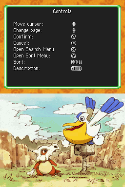
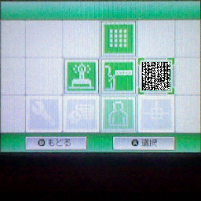
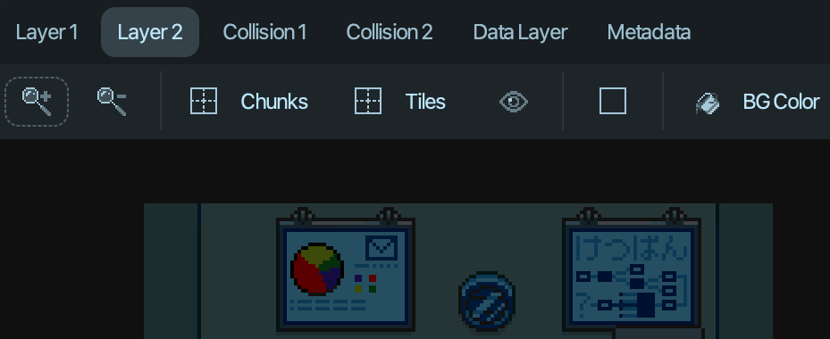
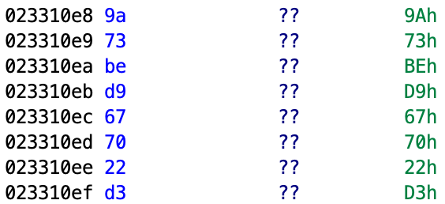

# Deceptive Decoy
> *We make dungeons go boom. Thus chaos will never bloom!*

MM5 acted as a soft reboot to the series; its participants were banned from referencing characters and events from past events. Consequently, this FORECAST introduced the existence of a secret organization, seeking only the most shrewd recruits from the shadows...

Recommended Resources:
- [CyberChef](https://gchq.github.io/CyberChef)
- [DotNetNdsToolkit](https://github.com/evandixon/DotNetNdsToolkit)
- [DSLazy](https://projectpokemon.org/home/files/file/2118-dslazy)
- [ExifTool](https://github.com/exiftool/exiftool)
- [gdb](https://sourceware.org/gdb)
- [Ghidra](https://github.com/NationalSecurityAgency/ghidra)
- [melonDS](https://melonds.kuribo64.net)
- [ndstool](https://github.com/blocksds/ndstool)
- [pmdsky-debug](https://github.com/UsernameFodder/pmdsky-debug)
- [SkyTemple](https://skytemple.org)
- [SSB Opcodes](https://wiki.skytemple.org/index.php/List_of_Opcodes)
- [Tinke](https://github.com/pleonex/tinke)

While this write-up will refrain from covering lore, I'd also like to highlight [a document](https://docs.google.com/document/d/1x46BQRTlR8ijC8qq4K_g8vq1ePU95acvaRBsfkSLvcY/edit?usp=sharing) that *does* cover lore, mainly written by [Chesyon](https://github.com/Chesyon), [happylappy](https://github.com/HappyLappy1), and silverfox88—three of the many solvers of this FORECAST!

## Solution
Contrary to what you're possibly fearing by looking at the resources above, this FORECAST ~~unfortunately~~ didn't actually require any reverse engineering—we'll just take a harmless little stab when analyzing *how* this FORECAST works later.

### New Game
Our journey begins at the end. The finale, that is; MM5 had the unique gimmick where the story was written backwards. The event organizers wrote the finale, then someone would write the scene meant to take place *prior* to that, and so on...

Much like all events before it, participants would only be able to view the contents of a single script—the script of the participant(s) that came before them. When a script's contents had to be cleaned, debug prints were allowed to stay intact. Messages of encouragement...of wisdom...and...
```js
debug_Print("Okay, everyone! Here's MysteryMail's Writing Tip of the Day!");
debug_Print("Sometimes you'll find yourself facing a difficult decision...");
debug_Print("When that happens, don't forget to save your game!");
```
In the above case of `SCRIPT/MYSTERY/finale.ssb`, a Doki Doki Literature Club quote. This can only mean pleasant things, so let's take these debug prints to heart. What happens when we save the game with `message_Menu(MENU_SAVE_MENU);` in any script of our choice?


And to really soothe us, an alarm sound effect plays, which soon hangs on a single note due to the game intentionally freezing. If we ever needed a red circle and a giant arrow pointing us in the direction of a secret, this is it! But where to start? we see a reference to the Top Menu, a suspicious URL, and the mention of cartridge removal...

### From The Top, Now!
There's more than one way to brew a cup of tea, but for the sake of simplicity, we'll take things in order of the message. Our ultimate goal is to enter the Top Menu. This makes sense, as unlike all events prior to this, MM5 actually doesn't enter the Top Menu to reach its scene selection menu. If we try to defy the spooky warning and jump to the Top Menu with `ProcessSpecial(PROCESS_SPECIAL_JUMP_TO_TITLE_SCREEN, 0, 0);`...nothing happens. Figures.

Let's first tackle the problem of reaching the Top Menu; best to claim the lost buried treasure before we worry about the key to open it. What sort of opcode could even help us in this situation? Most things that severely alter game state are things that invoke code beyond the scope of the script engine, like special processes and menus...which won't work, as we've tested.

When in doubt, consult the wiki! If we look at every opcode, we're bound to find something! Or we could just CTRL+F "Top Menu" if we're feeling lazy.

> [**0x8d - main_EnterDungeon**](https://wiki.skytemple.org/index.php/List_of_Opcodes#0x8d_-_main_EnterDungeon)
>
> Attempts to exit ground mode and begins dungeon mode at a specific dungeon.
>
> If attempting to run this opcode before selecting any option from the Top Menu, the game will not enter any dungeon and instead attempt to load a DEMO Unionall coroutine or the Top Menu. 

Exactly what we need! It makes sense too: can't have the game enter a dungeon without properly initializing the game mode (Main, Special Episode, or Rescue). Though, the wiki entry here almost a little *too* convenient. Who even documented this? Checking the [history](https://wiki.skytemple.org/index.php?title=List_of_Opcodes&action=history)...

> 01:55, 22 May 2024 **Adex** talk contribs 146,624 bytes (+195) *oops sint16, not sint + main_EnterDungeon clarification*

Oh, yeah. Right. ~~I guess the lesson learned is to monitor my wiki contributions, that way you'll always know what to expect.~~

Let's give this a try. If the wiki's right, it shouldn't matter which dungeon we enter, just that we enter something at all. For best effect, let's just overwrite the first two DEMO coroutines.
```js
coro DEMO_01 {
    main_EnterDungeon(0, 0);
    main_EnterDungeon(-1, 0);
    hold;
}

coro DEMO_02 {
    main_EnterDungeon(0, 0);
    main_EnterDungeon(-1, 0);
    hold;
}
```
We need to enter a dungeon twice to enter the Top Menu. As the wiki mentioned, the game will attempt a DEMO Unionall coroutine *or* the Top Menu. In the case of MM5, since the Top Menu is never entered, the first attempt at entering dungeon mode will restart Unionall back at coroutine `DEMO_02`, since the game first enters at `DEMO_01`. Let's run this and see where it takes us!



...and the game seems to freeze on this screen. Hm. The "Opcode Request Denied" warning *did* say that unauthorized access would be punished with cartridge ejection. And the screen did flash white for a brief moment before freezing on this image, which usually indicates cartridge ejection. Indeed, viewing `Misc. Graphics -> cart_removed.at` in SkyTemple shows this exact image. ~~Playing a bit too closely to MM3's FORECAST.~~

### Getting Up Close And Personal
This is progress! Now we just need to input a "personal message" somewhere. Which is...*really* vague. We need to know *what* to input and *where* in the first place. Guess we need to actually visit the link the warning gave us: https://tinyurl.com/d3c01403. This redirects us to Nintendo's official support page on changing the "Personal Message" on the DS, a 26-character string. This is part of the user firmware settings, alongside things like name, birthday, favorite color, and more.

Seems straightforward enough. Even if a participant isn't playing on hardware, a good chunk of NDS emulators out there allow for configuring these user settings! Let's opt for [MelonDS](https://melonds.kuribo64.net), as it'll be useful for multiple reasons we'll soon see.

But now comes the daunting task of actually deriving the correct personal message. It's not like we can brute-force this, either. We have a maximum 26 possible characters to work with...no idea of its length...and *much* more of a character set than plain old ANSI. We can't rule out the kana and DS-specific emoticons, after all. It's just not feasible to brute our way to success, though it's good to consider the possibility either way. Who knows when we might need to do it?

In any case, let's stop stalling and actually be literate just for a moment. The cart removal screen is clearly Unown text, but flipped horizontally ~~because the event was titled Backwards Chaos~~. Flipping it back around lets us decipher the text:
```
HOW VEXING!
OVERLAY SIX IS MORE
CURSE THAN BLESSING!
MUST THIS BE THE
KEY TO THE TOP?
PERHAPS OUR NEW MAILMAN
MASCOT HIDES A VITAL
ONE OF A KIND PROP!
```
While this screen does only show when you have the wrong personal message, it at least throws us a bone! "MUST THIS BE THE KEY TO THE TOP?" indicates as much, leaving us with the hints of:
- Overlay 6
- A mailman mascot's unique "prop"

The mention of Overlay 6 is the least vague of the two, so let's tackle that first. For the uninitiated, an NDS "overlay" is simply a big block of bytes. Both code and data can reside here and get loaded into memory when needed; an overlay is always loaded at a fixed address at runtime. This means we could have several big overlays that all *should* get loaded into memory at the same address, but at runtime we'd only ever have a single overlay loaded into that region of memory at a time. As an example relevant to EoS, take Ground Mode (cutscenes and overworld) versus Dungeon Mode. [`pmdsky-debug`](https://github.com/UsernameFodder/pmdsky-debug) lists the main Ground Mode overlay as [Overlay 11](https://github.com/UsernameFodder/pmdsky-debug/blob/master/symbols/overlay11.yml), while the main Dungeon Mode overlay is [Overlay 29](github.com/UsernameFodder/pmdsky-debug/blob/master/symbols/overlay29.yml). Both of these overlays have identical start addresses in memory:
```yaml
  address:
    EU: 0x22DCB80
    NA: 0x22DC240
    JP: 0x22DD8E0
```
This means Overlay 11 can *never* be loaded at the same time as Overlay 29. And why would it need to? They're two entirely different game states, so the space reuse here makes sense. Not like there's a need to play a cutscene in the middle of a dungeon. Space is a luxury on the NDS, so optimize when you can!

With that introduction out the way, what exactly *is* [Overlay 6](https://github.com/UsernameFodder/pmdsky-debug/blob/master/symbols/overlay06.yml)?
```yaml
  address:
    EU: 0x233D200
    NA: 0x233CA80
    JP: 0x233E300
  length:
    EU: 0x2460
    NA: 0x2460
    JP: 0x2460
  description: Controls the Wonder Mail S submenu within the top menu.
```
Another thing related to the Top Menu. At the time of writing this *and* throughout the time of this FORECAST's duration, the overlay hadn't been documented much. Only a single function now, and back then, absolutely nothing. How can we make something out of nothing?

We might as well take at the overlay before throwing in the towel. There are a handful of tools that can unpack and repack an NDS ROM out there, including:
- [DotNetNdsToolkit](https://github.com/evandixon/DotNetNdsToolkit)
- [DSLazy](https://projectpokemon.org/home/files/file/2118-dslazy)
- [ndstool](https://github.com/blocksds/ndstool)
- [Tinke](https://github.com/pleonex/tinke)

Once we've carved out the overlay using the tool of our choice, there should be something immediately glaring without having to inspect the file's contents: size. This overlay is 4,233 (0x1089) bytes—less than *half* of what it should normally be. Does this overlay even *work* anymore? How has it been changed?

For an unmodified NA ROM, the first 64 bytes of Overlay 6 are:
```
00000000: 08c0 9fe5 0800 9fe5 0c10 a0e3 1cff 2fe1  ............../.
00000010: 5032 0002 e0ee 3302 0410 9fe5 0000 81e5  P2....3.........
00000020: 1eff 2fe1 e0ee 3302 0400 9fe5 0000 90e5  ../...3.........
00000030: 1eff 2fe1 e0ee 3302 0410 9fe5 0400 81e5  ../...3.........
```
And for MM5's ROM:
```
00000000: 504b 0304 1400 0900 0800 95aa bc58 483d  PK...........XH=
00000010: abd2 d10f 0000 5b11 0000 0900 1c00 6465  ......[.......de
00000020: 636f 692e 706e 6755 5409 0003 e982 5666  coi.pngUT.....Vf
00000030: ec82 5666 7578 0b00 0104 f501 0000 0414  ..Vfux..........
```
*Everything* looks different! Quickly skimming over the rest of the bytes also shows as much—this is an entirely different file!

### What's The Magic Word?
While we can rest assured that we likely *don't* have to reverse engineer any code, that just leaves us with some unknown file. How do we figure out what it is?

You might have already noticed the `decoi.png` string in the above hex dump. It's not uncommon for code or data to coincidentally look like text, but this instance is certainly suspicious, *especially* this early in the file. Is there maybe a PNG hidden inside here? How do we get it? We'd have to know what sort of file we're dealing with in the first place...

As it turns out, identifying file type isn't as daunting as it may seem. It's all a game of pattern-matching, as files *must* follow some sort of defined structure to get interpreted by a program. A quick way to identify a file is by checking for a [magic sequence of bytes](https://en.wikipedia.org/wiki/List_of_file_signatures) at its beginning. For example, Windows portable executables begin with bytes `4D 5A` (in text, "PE"), Xdelta patches begin with the raw byte sequence `D6 C3 C4 00`...and ZIP files begin with `50 4B` (in text, "PK").

So this "Overlay 6" of ours is really just a ZIP file in disguise! Any NDS unpacker tool you used almost certainly gave Overlay 6 the `.bin` extension, but as it turns out, *file extensions are just a suggestion!* Take the `cart_removed.png` image in this repository, for instance. A perfectly valid PNG. Changing its name to `cart_removed.nds` *won't* magically make it a playable NDS ROM.

Before we move on, it's also important to note that not all file types will have a magic value at its start. As an extreme example, plain old text files don't have any specific magic or even a file format to speak of. It's just arbitrary data. However, even files with a defined format aren't guaranteed to have an easily identifiable magic sequence at its start. Take the files in EoS, for example. While you can see `AT4PX` at the start of all of your BGP files, you'll also notice that SSA files' first few bytes can vary.

We just happened to get lucky here. Let's try unzipping this file with any tool of our choice, and...
```
mm5 $unzip overlay_0006.bin 
Archive:  overlay_0006.bin
[overlay_0006.bin] decoi.png password:
```
We need a password to unzip the file, which should give us `decoi.png` as we saw in the hex dump earlier. We're unlikely to find a password by staring at the ZIP file itself, so we might as well loop back to the other hint the Unown text mentioned:
```
PERHAPS OUR NEW MAILMAN
MASCOT HIDES A VITAL
ONE OF A KIND PROP!
```
Just who is this "mascot" the text speaks of? If "mailman" refers to MysteryMail as a whole, the events up until now haven't really advertised a mascot of any kind. However...the MM5 ROM does show something distinct when we boot it up normally.



*Note: While the above screenshot shows the released version of MM5, the backgrounds on the Touch and Top Screen remained the same throughout the course of the event. ~~If you don't count [one participant](https://github.com/Jawshoeuh) sneakily adjusting the Top Screen, that is.~~*

Maybe that Minccino down there is the new "mascot" of ours? It's even holding a little letter. And looking back on past events' main backgrounds...

MM1 & MM2:



MM3 & MM4:


Minccino is definitely a new addition. Inputting variations of "Minccino" as the password doesn't unzip the file, so we have to dig a little deeper. What about Minccino can we find in the MM5 ROM? Let's try searching for it...


A Minccino Tail...might this be the "one-of-a-kind prop" we're looking for? Inspecting the item, we see that it's an Exclusive Item for Minccino—"one-of-a-kind prop" is just another way to phrase an Exclusive Item! This *must* be what we need; checking the Long Description of the item, we find...`4nd4nyr3m41n1n61n73r357myfr13nd5h4v31nm315ju57,"h3y,7h154n1m4lc4n74lk"`.

That looks suspiciously password-shaped. Plugging it into the Overlay 6 ZIP file...we finally get `decoi.png`!


Again with the spooky Minccino...

This image is suspiciously lacking in hints or a message of any kind, compared to how in-your-face `cart_removed.at` was. It *has* to be hiding something...let's first try checking the metadata with [ExifTool](https://github.com/exiftool/exiftool). We get a bunch of attributes out of running this, but among the most relevant:
```
File Size                       : 4.4 kB
File Type                       : PNG
MIME Type                       : image/png
Color Space                     : sRGB
Subject                         : Now THIS is personal.
Image Size                      : 256x96
```
The Subject field looks custom! *And* within the character limit for the personal message, at that! If we input this as our personal message and try to access the Top Menu...no dice. This message is likely just an indicator that the personal message *must* be derived from this image. And if we look closely at this image...there seems to be some barely visible text. If we change the background color in any image editor of our choice...


 
Aha! We find some Japanese: "なんでもできる！" This is *surely* what we need, but one might think to translate this into English before inputting it as the personal message. The thing is, Japanese is a highly contextual language. In a literal sense, the phrase is "can do anything!" But *who* can do anything? Me? You? It's not exactly clear in this instance, so we shouldn't make any assumptions. Since the personal message allows for inputting Hiragana (the alphabet this is written in), we'll do just that.

Finally...attempting to enter the Top Menu once more...


Success! We find ourselves introduced to an organization named the Dungeon Exploration, Control, & Obliteration Initiative (DECOI), of which this was all revealed to be the entrance exam! While the important bigwigs were all too busy doing who-knows-what, we at least get to talk with three chatbots and get to know more about the Initiative. Once we've seen all there is to see, we can fill out a survey to make a character join DECOI—our prize for completing this FORECAST!

## Optional Sidequest
While not relevant to solving this challenge, there is one additional "route" of sorts related to this FORECAST, specifically one mysterious character involved in it. I mentioned that we speak to three chatbots in the Top Menu. They are:
- A Minccino named "Dr. Martin Castle"
- A Sunkern without any name, since her parents hated her
- An unknown Bulbasaur(?) of sorts whose portraits have names

In particular, the weird Bulbasaur abomination is what we'll focus on. For those familiar with SpriteCollab, you might actually recognize them *not* as a Bulbasaur, but as [Missingno](<https://sprites.pmdcollab.org/#/0000?form=0>), which is more or less just a template to indicate portrait positions. This character never formally introduces himself and speaks in ciphertext. Suspicious! I want to know more about him. Where might he be in the MM5 ROM?

We could make an educated guess or just start checking every Pokémon entry, but the thing is, MM5 has the `ExpandPokeList` ASM patch applied, which gives us a whopping 2048 slots. We *could* check every entry, but there's a smarter way to go about deducing the ID of this mysterious Missingno. Why not let the game tell us at runtime with a debugger?

### Gosh Darn Breakpoints
There are a few options for NDS debuggers out there, but we'll focus on [GDB](https://sourceware.org/gdb) in this write-up, seeing as it has the most utility outside of NDS ROM hacking. In short, GDB is an old-as-dust command-line tool that can be used to debug all kinds of programs. Recent versions of MelonDS contain a "GDB stub", which allows a running GDB process to locally connect to MelonDS and debug the ROM like any other program! This *does* mean we'll be exposed to the game's assembly, but don't run away!

Let's install GDB, launch it, and also launch MM5 in MelonDS without making it past the "Access Granted" Top Menu screen. In MelonDS, `Config -> Emu settings -> Devtools` is what we'd want to look at. Enable the GDB stub here; note that the default port is 3333 for arm9. This can be anything you'd like, but we'll stick with 3333. In GDB, run `target remote localhost:3333`. If all's well, then the running game in Melon should halt, and we should see something like:
```
(gdb) target remote localhost:3333
Remote debugging using localhost:3333
warning: No executable has been specified and target does not support
determining executable automatically.  Try using the "file" command.
0x0207bc38 in ?? ()
(gdb)
```
Now we can do anything we'd like!

Our goal here isn't anything fancy; we just want to know the Pokémon ID of the mysterious Missingno. Playing out the MM5 Top Menu, you'll notice that each chatbot has a portrait on the Top Screen that changes frequently. We can safely assume that these are [native portraits](https://projectpokemon.org/home/docs/mystery-dungeon-nds/kaomadokao-file-format-r54) and not some [WAN object](https://projectpokemon.org/home/docs/mystery-dungeon-nds/wanwat-file-format-r50) jank. Ideally, there's a function in the game's code that creates a portrait based on a Pokémon ID, or at the very least, initializes a structure based off of it. Since portraits are a very common component of EoS, we also can also safely assume that the bulk of their relevant code *isn't* in an overlay that is specific to Ground or Dungeon Mode. Thus, [arm9](https://github.com/UsernameFodder/pmdsky-debug/blob/master/symbols/arm9.yml) seems like a good spot to check, as it's *always* loaded in memory regardless of overlay shenanigans. Simply searching for "portrait" in the symbols file eventually turns up the following:
```yaml
- name: InitPortraitParamsWithMonsterId
    address:
    EU: 0x204DB0C
    NA: 0x204D7D4
    JP: 0x204DB34
    description: |-
    Calls InitPortraitParams, and also initializes emote to PORTRAIT_NORMAL and monster ID to the passed argument.
    
    r0: portrait params pointer
    r1: monster ID
```
This looks convenient! Let's find out if the MM5 Top Menu uses this function. In GDB, we can set "breakpoints" in the context of the running program, so long as we have either an address or a symbol. A breakpoint is a mechanic telling the program to pause execution at a point of its code and pass control to a debugger. Thus, if we place a breakpoint on `InitPortraitParamsWithMonsterId`, then let the game resume execution, Melon will pause the game whenever it calls `InitPortraitParamsWithMonsterId`, giving control back up to GDB!

While we technically have both an address and a symbol to use, it's important to note that the symbols `pmdsky-debug` lists *aren't* the actual names of functions found within the ROM. They're just names given by reverse engineers that concisely describe what the function does. However, the "address" field *is* something we can use, so let's set a breakpoint using `b *<addr>` and continue the game with `c`!
```c
(gdb) b *0x204D7D4
Breakpoint 1 at 0x204d7d4
(gdb) c
Continuing.
```
Now we can resume the game, holding B to skip through the text...and...!
```c
Breakpoint 1, 0x0204d7d4 in ?? ()
(gdb)
```
Our breakpoint worked and our hunch was right! The game paused execution at address 0x0204D7D4, meaning `InitPortraitParamsWithMonsterId` was just called! With the game paused here, we can glean a *lot* of possible info about the current game state using GDB now. But all we really care about right now is what Pokémon ID the game called this function with. The documention from earlier listed register "r1" as being the "monster ID", which is just another way to refer to a Pokémon ID, its species, however you think of it. We can easily print the value of a register by just performing `p $<rX>` in GDB, where `X` is the register number. Let's give it a shot.
```c
(gdb) p $r1
$1 = 582
```
Checking SkyTemple, Pokémon 582 in the MM5 ROM appears to be Minccino. Not what we want, but this is *definitely* a good sign. Our breakpoint here won't disappear just because the program encountered it, so we can keep continuing until we find what we're looking for.
```c
(gdb) c
Continuing.

Breakpoint 1, 0x0204d7d4 in ?? ()
(gdb) p $r1
$2 = 191
(gdb) c
Continuing.

Breakpoint 1, 0x0204d7d4 in ?? ()
(gdb) p $r1
$3 = 581
(gdb) c
Continuing.
```
The game completely resumes now, as all the portraits have been created. Our breakpoint has hit for a total of three times, which also checks out. Pokémon 191 is Sunkern...and 581 belongs to the weird Missingno thingy! Yay!

Before we investigate Pokémon 581, I mentioned earlier that GDB was old and had applications outside of modifying a 2009 children's game—consequently, it has *ton* of resources floating around the Internet. It's a very powerful tool, and I only really scratched the surface of what it can do. There are also a bunch of customizations made to enhance the user experience, such as:
- [`gef`](https://github.com/hugsy/gef)
- [`peda`](https://github.com/longld/peda)
- [`pwndbg`](https://github.com/pwndbg/pwndbg)

You can even integrate Ghidra with GDB! Or, if you prefer to separate GDB from Ghidra, you could always [extract your Ghidra symbols](https://github.com/aldelaro5/ghidra-ExportDwarfELFSymbols) to a DWARF file, which can then be loaded into GDB via `add-symbol-file <file>`, allowing you to use symbols instead of raw addresses.

Finally (and possibly most relevantly), if you find yourself using [`c-of-time`](https://github.com/SkyTemple/c-of-time) and needing to debug your code, GDB is *especially* handy. You'll notice that running `make patch` produces the `out.elf` file; we can feed this into GDB and reference symbols of our own custom code!
```c
(gdb) add-symbol-file ./out.elf 
add symbol table from file "/forecast/ehlo/out.elf"
(y or n) y
Reading symbols from /forecast/ehlo/out.elf...
(gdb) target remote localhost:3333
Remote debugging using localhost:3333
warning: No executable has been specified and target does not support
determining executable automatically.  Try using the "file" command.
0x0207bc38 in ?? ()
(gdb) b *CustomCreateTopMenu
Breakpoint 1 at 0x2331140: file /forecast/ehlo/src/main.c, line 35.
(gdb) c
Continuing.

Breakpoint 1, CustomCreateTopMenu ()
    at /forecast/ehlo/src/main.c:35
35	    LoadMarkfontPal();
(gdb) ni
0x02331144	36	    TOP_DBOX_ID = CreateDialogueBox(&FULL_SCREEN_WINDOW_PARAMS);
(gdb) ni
0x02331148	35	    LoadMarkfontPal();
(gdb) ni
36	    TOP_DBOX_ID = CreateDialogueBox(&FULL_SCREEN_WINDOW_PARAMS);
(gdb) ni
0x02331150	36	    TOP_DBOX_ID = CreateDialogueBox(&FULL_SCREEN_WINDOW_PARAMS);
```
GDB is kind enough to show our actual C source code as we step through it! We can get even fancier with running `tui enable`, which splits the terminal to be half GDB, half source code...


Give it a whirl! :D

### 581: Number Missing
Tangent aside, let's finish what we started. Pokémon 581 in the MM5 ROM is named REDACTED, who has a suspiciously-long category name: "Error loading category; use SP 110 with this entity for more info."

SkyTemple lingo tends to abbreviate "SP" as either Special Process or Skypatch. "Skypatch 110" doesn't make much sense in the context of MysteryMail, so what about Special Process 110? Turns out, this special process has been included in the ROM for quite some time, but *not* by an event organizer. It was actually first [committed](https://github.com/Adex-8x/mm5-patches/commit/1fd1899991a7a08de961df1c1a16d519ea7ef586) by [Marius](https://github.com/marius851000), before the event even began. Does this Marius is in on the spooky Missingno conspiracy? Nah. Source: Me.

Let's follow the category's words of wisdom and run SP 110 in any script of our choice. Checking the [MM5 Features](https://github.com/Adex-8x/mm5-patches/wiki/MM5-Features) page on the repo's wiki, we see that SP 110 is documented as follows:
> 110: `DisplayImageOnTopScreen` (by [Marius](https://github.com/marius851000)). Displays a converted `.png` to the Top Screen. More specifically, it displays a `.raw` file from the `CUSTOM/SCREEN/` folder of the ROM. Ideally should be used while the Top Screen is in mode 0 via `back2_SetMode(0);`.
> - Param 1: File ID (i.e., a parameter of 1 will load 0001.raw)
> - Param 2: Unused
> - Returns: N/A

So if we run `ProcessSpecial(110, 581, 0);`, we should expect to see something on the Top Screen...



Quite the cryptic conundrum; there isn't any further hint to solving this other than what we see here. The personal message icon has been replaced with a strange black-and-white image resembling a QR code...might it be binary? Let's carve out the icon, careful not to lose any pixels...


Quick and dirty [Python script](./decode_sidequest_msg.py), go!
```
python3 decode_sidequest_msg.py img/0581_carved.png
The doctor escorted me and my brother out of the cave seven months ago. He won't share what he did to tame us. Or what my life was like. Or why I miss my brother.
```

A spooky success...

## Optional Epilogue
All of the above content was solvable by MM5 participants throughout the event (as well as a little bit after, to not be *too* unfair to the tail end participants). What follows now are additional, optional challenges related to the main FORECAST of this event! Traditionally, MysteryMail events contain a "name check" where the player could input a name. If a participant's name was inputted, special dialogue would play.

The same holds true this time around, but the name check seems to be hosted by a familiar, unnamed Minccino...

### Load Game
Let's try to be funny for a moment. What if we input the Minccino's name? The MM5 Top Menu introduces him as Dr. Martin Castle, so let's just go with "Dr. Castle" and see what we get...


Welp, we tried. But this doesn't seem to be the end of the road, as he goes on to describe that we *can* obtain the right credentials:
```js
message_Talk(" How can you get them,[W:20] you might ask?");
message_SetFaceOnly(ACTOR_UNKNOWN, FACE_WORRIED, FACE_POS_BOTTOM_R_FACEINW);
message_Talk("[VS:1:3] Well...[K][VS:1:2]every DOOR[W:10] has its LOCKS,[W:10] really.[VR]");
message_Talk(" So be sure to be on the lookout for\nany of them,[W:20] I suppose.[K] Especially for\nthings that look blatantly CUSTOM...");
message_KeyWait();
with(actor ACTOR_UNKNOWN) { ExecuteCommon(CORO_HEAD_SHAKE_FUNC_SERIES, 0); }
message_SetFaceOnly(ACTOR_UNKNOWN, FACE_NORMAL, FACE_POS_BOTTOM_R_FACEINW);
message_Talk(" Well,[W:20] I may have said too much,[W:10] but do\nbe sure to capitalize on this information.[K]\nThere's practically no space for error.");
message_Talk(" Best of luck.");
```
The way he phrases things is deliberate. MM5 is known to have the custom directory `CUSTOM` within the ROM, which contains some custom assets, as the custom name implies. Taking a peek at it, we find the inner directory `CUSTOM/NAME`, which only has two files:
- `door.bin`
- `onamaewa.bin`

### Shut The Front Door
Let's first tackle `door.bin`, seeing as it's the most relevant (the doctor mentioned a "DOOR") and that we can easily identify it:
```
00000000: 504b 0304 1400 0900 0800 2a39 2659 cfd0  PK........*9&Y..
00000010: eef2 b913 0000 af2e 0000 0800 1c00 646f  ..............do
00000020: 6f72 2e62 696e 5554 0900 03df e2da 66e5  or.binUT......f.
00000030: e2da 6675 780b 0001 04f5 0100 0004 1400  ..fux...........
```
Another password-protected ZIP, like before! The hunt begins once more. Dr. Castle mentioned that "every DOOR has its LOCKS," so where we might find locks? Maybe in the script of the name check? [`Lock`](https://wiki.skytemple.org/index.php/List_of_Opcodes#0x8b_-_Lock) is a valid SSB opcode, after all. We can find the name check script in `SCRIPT/MYSTERY/check.ssb`, so searching for any instances of the `Lock` opcode...
```js
def 4 for actor(ACTOR_PLAYER) {
    Lock(9);
    Lock(11);
    Lock(14);
    Lock(15);
    Lock(23);
    Lock(20);
    Lock(8);
    Lock(5);
    Lock(4);
    Lock(9);
    Lock(6);
    Lock(6);
    Lock(5);
    Lock(18);
    Lock(5);
    Lock(14);
    Lock(3);
    Lock(5);
    Lock(2);
    Lock(5);
    Lock(20);
    Lock(23);
    Lock(5);
    Lock(5);
    Lock(14);
    Lock(23);
    Lock(8);
    Lock(1);
    Lock(20);
    Lock(9);
    Lock(23);
    Lock(1);
    Lock(14);
    Lock(20);
    Lock(1);
    Lock(14);
    Lock(4);
    Lock(23);
    Lock(8);
    Lock(1);
    Lock(20);
    Lock(9);
    Lock(7);
    Lock(15);
    Lock(20);
    hold;
}
```
We stumble upon a suspicious sequence of semaphores! These don't appear to have any functional value, seeing as:
- The `PLAYER` actor doesn't exist in this script's corresponding SSA file
- [`Unlock`](https://wiki.skytemple.org/index.php/List_of_Opcodes#0x156_-_Unlock) is seldom called in the main routine
- Out-of-bounds lock IDs are used

Could it simply be some sort of A1Z26 cipher, since the lock IDs are all within the range [1, 26]? This would also make sense, considering two of the hints given by Dr. Castle...
> *"Well, I may have said too much, but do be sure to **capitalize** on this information. There's practically **no space** for error."*

If it really is just as simple as A1Z26, this dialogue also gives the exact format of the potential password, that way we don't have to guesstimate our way to success. We can have another lazy [Python script](./decode_player_locks.py) thrown together, which yields...
```
python3 decode_player_locks.py
IKNOWTHEDIFFERENCEBETWEENWHATIWANTANDWHATIGOT
```
Plugging this into `door.bin`, we get a successful decrypt, revealing the file...`door.bin`. Huh. Taking a quick peek at it in a hex editor, we find...
```
00000000: ffa2 acba b2b6 abdf bbb0 b0b8 dfa8 beac  ................
00000010: dfad baa9 bab1 dfa8 beac dfad baa9 bab1  ................
00000020: dfba b7df bbb1 bedf acba b2b6 abdf bbb0  ................
00000030: b0b8 dfba b7ab dfa8 beac dfad baa9 bab1  ................
```
Nothing we can really interpret, unfortunately. What can we even do with this mysterious file? As it turns out, nothing!

Kinda. See, the source code for MM5 has been available all this time, and by the time the final patch was released, so was the code that also handled the name check. I've mostly refrained from mentioning it in this section to discuss it more in the Design section, but we'll make an exception here. Wandering around in the repo, we find [this suspicious blob](https://github.com/Adex-8x/mm5-patches/blob/abd1178181b6ac1c87451f8615c02879a5c148c2/src/menus.c#L187-L205)...
```c
/*
  ???
*/
int TryAcceptClassifiedCategory(int himitsu_index)
{
    int category = 581;
    struct file_stream file;
    char* script_strings[2];
    DataTransferInit();
    FileInit(&file);
    FileOpen(&file, "CUSTOM/NAME/door.bin");
    int size = FileGetSize(&file);
    struct himitsu_check* himitsu_buffer = MemAlloc(size, 0);
    char* shenanigans = himitsu_buffer;
    int read_bytes = FileRead(&file, himitsu_buffer, size);
    FileClose(&file);
    DataTransferStop();
    if(read_bytes > 0 && shenanigans[0] != 'P' && shenanigans[1] != 'K')
    {
      // blah blah more code below here
```
So `door.bin` *does* get referenced at runtime! What's more, there's a check to ensure the first two bytes of the file are *not* equal to "PK". We already know these to be the two magic bytes that must be at the start of a ZIP file. In that case, we don't even have to read any code within the if-block; we can just repack the ROM with the decompressed `door.bin` and see what happens!

Repacking the ROM...trying to input "Dr. Castle" once more when prompted for a name...and...!


The dialogue is different! Looks like repacking the ROM with the decompressed `door.bin` was indeed the solution! Though, it doesn't look like the doctor shares our sense of humor...

Casting aside our comedic aspirations, we can try and see if there are other "classified" names. Solvers of this FORECAST might immediately think to enter the character they submitted in the survey, and indeed, all survey characters have special dialogue! Interestingly, all special dialogue seems to be outright *missing* from the script itself—we'll cover where exactly the dialogue resides in the Design section.

Since Dr. Castle had an entry of his own, what about the other two Pokémon we saw in the Top Menu? Inputting "Sunkern" gives us special dialogue as expected, but...we never learned the name of Pokémon 581. What could it be?

### 581: Name Missing
There are actually two ways to derive the name of this mysterious monster. We *could* look at more code in the MM5 repo to figure out how exactly the name check uses `door.bin` and `onamaewa.bin`—"onamaewa" especially stands out since it's able to be translated as "what is your name?"

However, there's a quicker, sneakier method. We'll still look at a bit of code, but within `SCRIPT/MYSTERY/check.ssb` rather than the repo's C code. Earlier, we noticed that the special "classified" dialogue doesn't exist within the script. However, what *does* exist is the name-to-case mapping, since everything is handled in a big switch-statment. We can deduce the following:
- Cases 200-210 are for the survey-submitted Pokémon, given that the opcode `message_Talk(' Aha,[W:20][VS:1:2] [journal]...![VR][K]\nOne of our many applicants...!');` exists.
- Case 211 is for Dr. Castle.
- Case 212 is for Sunkern.

Which leaves us with Case 213:
```js
case 213:
    se_Play(8962);
    SetEffect<actor ACTOR_UNKNOWN>(EFFECT_QUESTION_MARK, 3);
    WaitEffect<actor ACTOR_UNKNOWN>();
    WaitExecuteLives(ACTOR_UNKNOWN);
    message_SetFaceOnly(ACTOR_UNKNOWN, FACE_WORRIED, FACE_POS_BOTTOM_R_FACEINW);
    message_Talk('A                                                                                                                                                                                                                                                                                                                                                                                                                                                                                                                              ');
    CallCommon(CORO_MESSAGE_CLOSE_WAIT_FUNC);
    Wait(10);
    Turn2Direction<actor ACTOR_UNKNOWN>(8, 10, DIR_UPRIGHT);
    WaitExecuteLives(ACTOR_UNKNOWN);
    Wait(90);
    Turn2Direction<actor ACTOR_UNKNOWN>(4, 10, DIR_DOWN);
    WaitExecuteLives(ACTOR_UNKNOWN);
    message_Talk('1                                                                                                                                                                                                                                                                                                                                                                                                                                                                                                                              ');
    jump @label_47;
```
These mysterious "A" and "1" strings are also used by the other special cases, so we can ignore them for now. Dr. Castle seems to look upright and pause in between his two messages. Looking at the backgruond, his eyes would likely meet a whiteboard with some drawings on it. It almost looks like something is scribbled out near the top...let's take a closer look at the background in SkyTemple.

The script uses `LEVEL_CHECK`, which itself uses the Map Background `NANDEMO`. This Map Background has Two Layers, but the second layer is *only* for the scribble on the whiteboard! We can remove it by replacing the scribble with transparent chunks, revealing:



Hiragana, it looks like. Specifically, "けつばん". Romanized, this would be "ketsuban". If we give that a try...


Success! If you can even call it that; the game freezes on the image shown above. 

Only a roar is heard, at last, the game now turned to stone.

## Design
We've certainly come a long way in terms of challenge design compared to MM3's FORECAST! We have custom code in a sparsely-documented overlay, password-protected archives, custom files...where to begin?

Let's work our way bottom-up, starting from the most recent additions and ending with the Top Menu. After all, the optional challenges are still fresh in our minds, and the Top Menu is the most complex thing we have to analyze in this FORECAST, despite not actually holding that many secrets.

### OKですか？
First off, we never gave `onamaewa.bin` the attention it deserves. As the name implies, this is the file that maps each name to a case in `check.ssb`'s big switch-statement. But taking a peek at the file:
```
00000000: 5734 1f55 1324 2711 6247 7767 6745 6d14  W4.U.$'.bGwggEm.
00000010: 2c29 5817 6457 3530 5958 6e7f 0c1a 270e  ,)X.dW50YXn...'.
00000020: 372b 3514 0317 7165 535b 2544 1132 3a1f  7+5...qeS[%D.2:.
00000030: 3b39 2575 664f 4a06 3721 3808 013a 7767  ;9%ufOJ.7!8..:wg
```
Much like `door.bin`'s decompressed form, it's a file type we can't really make out. But somehow, *somehow*, the game has to derive a plaintext name out of this mess!

We can find out where exactly the game handles `onamaewa.bin` by once again checking the MM5 repo. Our function of interest is [`GetSpecialNameCategory`](https://github.com/Adex-8x/mm5-patches/blob/abd1178181b6ac1c87451f8615c02879a5c148c2/src/menus.c#L145-L185). Skimming past the beginning code, which just seems to do initialization junk (and casting the inputted name to all lowercase), we find some suspicious decryption code:
```c
        char* encrypted_buffer = onamaewa_buffer;
        for(int i = 0; i < size; i++)
            encrypted_buffer[i] ^= script_string[i];
```
Exclusive-OR (XOR) is quite the handy, yet simple, operation in cryptography. In a nutshell, `A XOR B` performs "A or B must be 1, but *not* both" on every single bit between two numbers, where 0 is false and 1 is true. The magic here is that XOR is reversible. For `A XOR B = C`, `C XOR B = A`, and consequently, `C XOR A = B`. No matter how fancy one might get when designing a cipher, XOR is most likely a component of it due to the fact that you can encrypt and decrypt so easily! Opting to *only* perform XOR between a plaintext message and a key *isn't* secure by any means, but it does get the job done in obfuscating the messages.

That leaves us with determining what exactly `script_string` points to. The only other reference to it is earlier in the function:
```c
char* script_string = GetScriptString(SCRIPT_STRUCT_UNK_PTR, 0);
```
Which isn't very helpful. `SCRIPT_STRUCT_UNK_PTR` is defined as a `undefined4*`. Equally unhelpful. We *could* look at the addresses defined for `GetScriptString` or `SCRIPT_STRUCT_UNK_PTR` and cross-reference them in pmdsky-debug and/or Ghidra...but haven't we found ourselves in this situation before? Why not force the game to tell us the value with GDB?

It's more or less the same process as earlier, when we deduced けつばん's species ID. This time, however, we have access to the source code! Let's build MM5's code and add `out.elf` as a symbols file to GDB!
```c
(gdb) add-symbol-file ./out.elf 
add symbol table from file "/forecast/chat/out.elf"
(y or n) y
Reading symbols from /forecast/chat/out.elf...
(gdb) b menus.c:152
Breakpoint 1 at 0x23dd074: file /forecast/chat/src/menus.c, line 152.
(gdb) c
Continuing.

Breakpoint 1, GetSpecialNameCategory (buffer=0x2388ed4 "a")
    at /forecast/chat/src/menus.c:154
154	    strncpy(name_check_string, buffer, 10);
```
Breakpoint hit! Not on the exact line we defined, but we can chalk that up to `GetSpecialNameCategory` being inlined within `NewMenuEnd`. Regardless, GDB even shows the `buffer` parameter as the string "a", which is what I inputted in the keyboard prompt. We can `disas` from here to show where exactly where are in our compiled ASM, or `tui enable` to also show it relative to the C source!

But if we really wanted to, we could simply just...print out the variable.
```c
(gdb) p script_string
$1 = 0x212a2dc "V2l0aCBhbGwgdGhlIG1vdW50YWlucyBoYXZpbmcgY3J1bWJsZWQgdG8gZHVzdCwgdGhlIGJpdHRlciB3aW5kIGNvdWxkIHRlYXIgdGhyb3VnaCB0aGUgbGFuZCBhbmQgY2hpbGwgdGhlIHR3byB3aXRuZXNzZXMgaGFsZiB0byBkZWF0aC4KCk5vdGFibHksIG91ciBl"...
```
That's...something to work with! We've got something so big that GDB truncates it, although this could be fixed by doing `set print elements 0`. This string hasn't been mentioned yet throughout this write-up, but if you've been following along, the string might look familiar regardless: it's actually the first string debug printed in `check.ssb`! We've got our key! Incidentally, it also doubles as a message encoded in Base64.

This is all that's needed to decrypt `onamaewa.bin`! Incidentally, we don't necessarily need to decrypt the file to know how it's formatted, taking a second look at the code:
```c
        for(int i = 0; i < __divsi3(size, sizeof(struct special_check)); i++)
        {
            struct special_check entry = onamaewa_buffer[i];
            if(entry.category == 0)
                break;
            int length = entry.length;
            if(strncmp(lowercase_name, entry.name, length) == 0)
            {
                category = entry.category;
                break;
            }
        }
```
In short, once we decrypt the file, we expect it to be list of the [`special_check` struct](https://github.com/Adex-8x/mm5-patches/blob/abd1178181b6ac1c87451f8615c02879a5c148c2/src/extern.h#L52-L59), then just compare each name with the user-inputted string. This struct is defined as:
```c
// The struct used to define special names and their categories.
struct special_check {
  uint8_t category;
  uint8_t length;
  char name[10];
  uint8_t unk_0xC; // For the fellow nerds out there
};
ASSERT_SIZE(struct special_check, 13);
```
"An unknown field?" I hear you shout in disbelief, "what do you *mean* unknown?! *You designed this file format!!!!!*"

And obviously fueled by pure rage, you would soon scramble to throw [something hasty](./print_onamaewa_unk_0xC.py) together to decrypt `onamaewa.bin` and prove my ineptitude:
```
python3 print_onamaewa_unk_0xC.py mm5.nds
CORRUPTIONISAHORRIFYINGYETEFFECTIVESOLUTIONITPOISONSANYTHINGWITHINFORMATIONITCANNOTSTOMACHANDIAMLIVINGPROOFOFSUCH
```
But in doing so, you also prove your nerd status!

### Behind Closed Doors
Like `onamaewa.bin`, `door.bin` has its own file format *and* is encrypted using a simple scheme meant to mainly stop a hex editor's prying eyes. The relevant function in the MM5 repo is [`TryAcceptClassifiedCategory`](https://github.com/Adex-8x/mm5-patches/blob/abd1178181b6ac1c87451f8615c02879a5c148c2/src/menus.c#L187-L229), with the relevant struct being [`himitsu_check`](https://github.com/Adex-8x/mm5-patches/blob/abd1178181b6ac1c87451f8615c02879a5c148c2/src/extern.h#L61-L66):
```c
// The struct used to define...something.
struct himitsu_check {
  uint16_t length[2];
  uint32_t offsets[2];
};
ASSERT_SIZE(struct himitsu_check, 12);
```
The definition here leaves much to be desired for. True, it's vague on purpose, but it also speaks to the file format's simplicity. Not only that, but the decryption for `door.bin` is actually simpler compared to `onamaewa.bin`:
```c
        for(int i = 0; i < size>>1; i++)
        {
            int j = size-1-i;
            if(i != j)
            {
                shenanigans[i] ^= shenanigans[j];
                shenanigans[j] ^= shenanigans[i];
                shenanigans[i] ^= shenanigans[j];
                shenanigans[i] ^= 0xFF;
                shenanigans[j] ^= 0xFF;
            }
        }
```
Lots of XOR operations! We established earlier that XOR is easily reversible; because of this property, the three XORs with `shenanigans[i]` and `shenanigans[j]` actually amount to a simple swap. Following the swap, both bytes are XOR'd with 0xFF. As far as *which* bytes are swapped, the loop above swaps bytes from the bounds of the file (start and end), then slowly works its way inward until the middle is reached.

Don't let the swap deceive you: the use of a single-byte XOR key here is *far* weaker than the multi-byte key `onamaewa.bin` relied on. Some pattern-matching tools like [YARA](https://yara.readthedocs.io/en/latest/) even contain an option for detecting strings that have been single-byte XOR'd, since it's just that simple. The bigger obstacle to `door.bin` was the "unlocking" we did earlier, so I thought against doing something elaborate when this is an optional challenge.

Regardless, after the decryption, we see:
```c
        struct himitsu_check entry = himitsu_buffer[himitsu_index];
        for(int i = 0; i < 2; i ++)
        {
            script_strings[i] = GetScriptString(SCRIPT_STRUCT_UNK_PTR, i+1);
            MemZero(script_strings[i], strlen(script_strings[i]));
            strncpy(script_strings[i], shenanigans+entry.offsets[i], entry.length[i]);
        }
        category = himitsu_index+200;
```
We see the spooky combo of `GetScriptString` and `SCRIPT_STRUCT_UNK_PTR`. This time, however, we *know* that these are related for directly accessing a script's string while it's loaded in memory. In a nutshell, this code overwrites the first and second `check.ssb` script strings with special dialogue from `door.bin`!

Scrambling back to Python yet again, we wind up with a [script](./print_door_dialogue.py) that can print out the two special strings for any given index! In particular, we never *did* find out the source of the game crashing when we inputted けつばん. Checking the strings using Index 13...
```
python3 print_door_dialogue.py mm5.nds
 Hm?[K] Where...
 Ah,[W:20] you can read the writing.[K]
Not really a surprise.[C] What's really a surprise though is how [TS:6930] [W:8][FACE:12][W:2] [HE WANTS NOTHING MORE THAN TO RID HIMSELF OF THE BLESSING THE DOCTOR HAS GRACIOUSLY GIVEN HIM, TO FORGET IT ALL AND TO FORGET IT ALL AND TO FORGET IT ALL; TO CLAIM HE SEES ALL WOULD BE A LIE, AS HE WILL NEVER SEE THE BRIGHT LIGHTS AND NEVER HAVE A GOOD TIME AND HE NEVER SAW THE BRIGHT LIGHTS AND HE NEVER SAW THE GOOD TIMES AND HE NEVER SAW NEVER SAW GOOD TIMES]
```
Aha, an invalid text tag! So it *was* an intentional design choice...

### A Linker To The Top
Finally, we jump back to the Top Menu. As a testament to how tailor-made it was for this game and stage, its code is *entirely* absent from Overlay 36! Having learned from last FORECAST, I wanted to squash any opportunity that someone could accidentally stumble their way into the Top Menu. A handful of things had to be done, but perhaps the most vital was keeping the custom code hidden even when the MM5 repo was public throughout the course of the event. How was this done? A simple answer could be that I just wrote everything in ASM, and honestly, it wouldn't be the worst thing in the world. But no, it's still C code, just all located in Overlay 1 thanks to...

Linker sections!


[A CoT feature added in May 2024](https://github.com/SkyTemple/c-of-time/pull/259), linker sections allow for injecting your compiled code in places other than Overlay 36's common area. The file responsible for customizing this is aptly named [`linker.ld`](https://github.com/SkyTemple/c-of-time/blob/main/linker.ld), which even has some comments explaining how you can configure it. In the case of MM5, I completed the entire Top Menu before the repo went public, removed the Overlay 1 linker sections in `linker.ld`, and disallowed contributors from adding custom code in the Top Menu overlays. That way, no contributor could accidentally mess with the secret code!

In fact, you can even see these linker sections referenced once we load into the MM5 Top Menu:
> Finished reading C patch section from ov 1: .text.ov.1.CREATETOPMENU 0x23310e8 \
> Finished reading C patch section from ov 1: .text.ov.1.UPDATETOPMENU 0x2331788

"Hold the phone," I hear the neurons in your head firing yet again, "if all you did was place your code and data in Overlay 1, then the quest for the personal message was pointless! I can just chuck Overlay 1 into Ghidra, compare the changed bytes with an unedited ROM, and see the Top Menu without ever knowing the personal message!"

And sure, you *can* do just that!



Highlighting these eight bytes and pressing "D" to disassemble...we only get `ldmible    lr!,{r1 r3 r4 r7 r8 r9 r12 sp lr}` from the first four bytes, the other four failing to disassemble. Hm. The rest of the code down below also either gives strange intructions or outright fails to disassemble.

This can't be right. Maybe it's a bug with Ghidra? "I always *knew* IDA was better," I hear you begin to protest. You might be right, but to double-check that something didn't go horribly wrong, let's just enter the Top Menu at runtime and disassemble a bit of the code.
```c
(gdb) disas 0x23310e8,+0x10
Dump of assembler code from 0x23310e8 to 0x23310f8:
   0x023310e8:	push	{r4, r5, r6, r7, r8, r9, lr}
   0x023310ec:	mov	r4, #0
   0x023310f0:	ldr	r8, [pc, #376]	@ 0x2331270
   0x023310f4:	mvn	r3, #5
End of assembler dump.
```
...

It's not like static analysis would be that easy, considering all the ~~very basic and insecure~~ encryption we've seen thus far!

### Panic Analysis
No matter which static analysis tool you opt to perform disassembly in, you'll find similar results. Indeed, a quick byte search over the entire ROM confirms your worst suspicions: Overlay 1's code is being changed *at runtime*! This was a necessary step to stop accidental solves. Can't really call it secret code if it's blatantly out in the open; think of the dialogue, too! As a challenge designer, having unencrypted strings here would be begging for trouble.

Deducing where Overlay 1 gets changed *could* be achieved with a memory watchpoint in GDB...but at the time of writing this, Melon doesn't have this feature supported yet. [No$gba](https://problemkaputt.de/gba.htm), on the other hand, *does* have this, if you're willing and able to use Windows or Wine. In the effort of being platform-agnostic as possible, though, we'll stick to GDB.

We can still work with this! Recall earlier, where we got the "Opcode Request Denied" message. It specifically threatened cartridge ejection if we inputted the wrong personal message, which means there's a *very* good chance it calls the `CardPullOut` function:
```yaml
- name: CardPullOut
    address:
    EU: 0x2003D70
    NA: 0x2003D70
    JP: 0x2003D70
```
So one approach could be to set a breakpoint here, then immediately check the link register (r14/lr) to see the callsite. Let's give it a shot!
```c
(gdb) b *0x2003D70
Breakpoint 1 at 0x2003d70
(gdb) c
Continuing.

Breakpoint 1, 0x02003d70 in ?? ()
(gdb) p/x $r14
$1 = 0x2062c18
(gdb) disas 0x2062c14,+0x20
Dump of assembler code from 0x2062c14 to 0x2062c34:
   0x02062c14:	bl	0x2003d70
   0x02062c18:	b	0x2062c14
   0x02062c1c:	mov	r0, #1
   0x02062c20:	bl	0x2025b90
   0x02062c24:	mov	r5, #0
   0x02062c28:	ldr	r0, [pc, #168]	@ 0x2062cd8
   0x02062c2c:	add	r1, r0, #4
   0x02062c30:	ldr	r1, [r1, r5, lsl #2]
End of assembler dump.
```
Two things immediately stand out here. First, that's a *very* evil infinite loop at `0x02062c18`. Second, cross-referencing with pmdsky-debug reveals that we're *allegedly* in `CanDungeonBeUsedForMission`. A quick glance at Ghidra shows that these aren't the instructions we're looking for, which should *instead* be:
```arm
moveq r0, #0
popeq {r3, r4, r5, pc}
mvn r0, #0
cmp r4, r0
beq #0x2062c44
cmp r4, #0xb4
bge #0x2062c44
mov r0, r4
```
So it looks like `CanDungeonBeUsedForMission` was modified to have some *more* custom code!

### Achievement Get! How Did We Get Here?
From here on out, any reverse engineering of MM5 is left as an exercise to the reader. Let's circle back to the general design: *why* are we here in this mission function and *what* is this code doing to decrypt Overlay 1's custom code?

It turns out that a few mission-related functions were clobbered to place some of our secret self-modifying code. In fact, MM5 participants were also prohibited from editing mission-related functions ~~(I'd link the MM5 repo wiki page that imposes this rule, but for some reason the page vanished??? No, this isn't a bit, I'm sad)~~, which surprisingly went under the radar. Our entry *into* these mission functions comes from a small patch, still in arm9.
```arm
.org 0x0204686c
.area 0x4
    bl CreateDialogueBoxAndDecrypt
.endarea

.org 0x02062BB8
.area 0x02062d3c-0x02062BB8+0x4
    ldr r0,=SPECIAL_WINDOW_PARAMS
    bx r14
CreateDialogueBoxAndDecrypt:
    push r4,r5,r14
    sub r13,r13,#0x54
    bl CreateDialogueBox
    mov r4,r0
    mov r0,r13
    bl GetDsFirmwareInfo
    ; blah blah more spoopy code below...
```
Oh right, the source for the self-modifying code was written in ASM rather than C. I could've opted for C, but what it does isn't anything too complex. Besides, the more I write in C, the more I have to actively work to hide it. With ASM, I basically just patched the ROM, yeeted it from CoT, told participants "hey no touchy", and...it worked out perfectly! I doubt I'll avoid scrutiny moving forward, though.

But wait, how did we even arrive at `0x0204686C` in the first place? The original instruction is a call to `CreateDialogueBox`, so while this explains the initial "Access Granted" textbox, it does *not* reveal how this ever pops up in the base game. It's not like a scrolling textbox often appears in the Top Menu upon startup, after all.

Turns out, the patch needing to enable this is a simple one-liner, albeit in Overlay 0:
```arm
.org 0x022be27c ; creates wifi box
.area 0x4
    nop
.endarea
```
I overwrote a `bne`, belonging in area that checked whether a textbox should display upon entering the Top Menu, warning the player with Text String 584:
> [CN]The corrupted Nintendo Wi-Fi Connection \
> [CN]User Information has been deleted.

~~A bit ironic, considering the hidden text in `BACK/w_esrb.bgp`...~~

With this patch, I had an easy approach to writing code that could *only* execute once Overlay 1 was loaded, but *before* its menu-related code (at `0x023310E8`) executed! Deducing this spot in the first place was mainly guided by Text Strings, as it's not often that you'll find the value 584 stored as an immediate value in an instruction. There's a handful of ways to search the ROM for this, but I opted for Ghidra's `Search -> For Instruction Patterns`. Alternatively, if the Text String couldn't be stored in an immediate, then it very likely exists as four bytes of data, so you can just `Search -> Memory` instead.

Oh yeah, and obviously I didn't *actually* use Text String 584 for the "Access Granted" textbox. Instead, I just hijacked the game to play a raw string, rather than pull from Text String 584:
```arm
.org 0x02046910
.area 0x4
    bl GenerateDailyMissions+0x4
.endarea

.org GenerateDailyMissions
.area 0x0205eac4-GenerateDailyMissions+0x4
    bx r14
    ldr r2,=SPOOKY_TEXT
    b ShowStringInDialogueBox
SPOOKY_TEXT:
    .ascii "[TS:16139] [VS:1:20][FT:2][CN]DECOI
    ; string truncated for brevity
```
But now we know where we are and how we got here!

### A Linker Between Decrypts
It's finally time to cover how the code decryption actually works! Truth be told, it's actually pretty straightforward. In a nutshell, the entire NDS personal message is used as an XOR key:
```arm
DecoiDecryption: ; r0: start, r1: end, ret: sum
    push r4-r6,r14
    sub r13,r13,#0x54
    mov r4,r0
    mov r5,r1
    mov r0,r13
    bl GetDsFirmwareInfo
    ldrh r6,[r13,#0x52] ; Length
    lsl r6,r6,#0x1
    add r0,r13,#0x1C
    mov r1,#0x0
decryption_loop:
    ldrh r2,[r0,r1]
    ldrh r3,[r4]
    eor r2,r2,r3
    strh r2,[r4],#0x2
    add r1,r1,#0x2
    cmp r1,r6
    movge r1,#0x0
    cmp r4,r5
    ble decryption_loop
    add r13,r13,#0x54
    pop r4-r6,r15
```
Specifically, the `eor r2,r2,r3` does the actual XOR. Since each character of the NDS personal message is stored as a 16-bit value, we opt for loading and storing data in halfwords. So essence, if you pretend `data` is an array of `uint16_t` values:
1. `な` XOR `data[0]`
2. `ん` XOR `data[1]`
3. `で` XOR `data[2]`
4. `も` XOR `data[3]`

And so on. Whenever we reach the end of the personal message (character `！`), we loop back to the start (character `な`). This decryption sequence is performed against four address ranges:
```arm
ADDR_LIST:
    .word GenerateDailyMissions+0x4, 0x0205E9D0
    .word 0x23310e8, 0x2331288
    .word 0x2331788, 0x2331dd8
    .word 0x233250c, 0x2334ed2
    .word 0x0, 0x0
```
The final entry of `ADDR_LIST` is just the null terminator marking the end of our decryption. Three of these entries are Overlay 1 linker sections:
```
create_main_menu    : ORIGIN = 0x23310E8, LENGTH = 0x1A0
update_main_menu    : ORIGIN = 0x2331788, LENGTH = 0x650
data_main_menu      : ORIGIN = 0x233250C, LENGTH = 0x29C6
```
And the first entry of `ADDR_LIST` is in arm9, which holds the "Access Granted" string, as well as the code that displays it.

But don't get the wrong idea—these four ranges *don't* get modified if the personal message is incorrect! But what even defines what's "correct" in the first place? Designing this part required some care, as some immediate solutions to "How do we check for a correct message?" have fatal flaws:
- Storing a copy of the personal message and comparing against it is the simplest way of gatekeeping the player. In fact, it's *too* simple. Some very basic reverse engineering would trivialize all the work put into this FORECAST!
  - Though, if the intent of the challenge *was* to perform reverse engineering, then this would be acceptable.
  - [One EoS hack](https://hacks.skytemple.org/h/fragments3) falls exactly under this approach!
- We *could* decrypt first, then check for a known good value in the decrypted data. You might think this is a step above leaking the personal message in plaintext, but since the personal message is the encryption key, this *still* leaks it due the property of XOR!
  - Say we specifically checked if the four bytes at `0x023310E8` translated to the instruction `push	{r4, r5, r6, r7, r8, r9, lr}` after our decrypt. This means we have access to ciphertext and plaintext, so performing `ciphertext XOR plaintext` yields the first two characters of the personal message!
  - While not exactly the same situation, [one EoS hack](https://hacks.skytemple.org/h/vantasma) can have its encryption thwarted by a similar known-plaintext attack!

A simple-yet-secure approach could be to [hash](https://en.wikipedia.org/wiki/Hash_function) the personal message in some way, then compare against that hash value. This does leaks the hash value, but a good hash function would render that having value pointless to an attacker. You shouldn't be able to derive the plaintext just from its hash.

MM5 *kinda* opts for the hash approach. It's a pretty poor approach, and much more of a checksum than a hash, but it's quick and gets the job done well enough. It relies on our good friend XOR once more, this time XORing every single character of the personal message to compare against a final value:
```arm
    mov r0,r13
    bl GetDsFirmwareInfo
    mov r5,#0
    ldrh r12,[r13,#0x52] ; Length
    ldrh r1,[r13,#0x1C]
    add r0,r13,#0x1E
    b message_loop_next_iter
message_loop:
    ldrh r2,[r0],#0x2
    cmp r2,#0
    beq message_sanity_check
    eor r1,r1,r2
message_loop_next_iter:
    cmp r5,r12
    addlt r5,r5,#0x1
    blt message_loop
message_sanity_check:
    ldr r0,=#53180
    cmp r0,r1
    beq message_ok
message_incorrect:
    bl CardPullOut
    b message_incorrect
message_ok:
```
Once again, the `eor` instruction does most of the heavy lifting. If XORing all of the personal message's characters *doesn't* equal 53180, then the cartridge is ejected. Otherwise, we know we're in the clear and decrypt Overlay 1!

But I mentioned this wasn't exactly the best approach. A *good* hash algorithm should be resistant against [hash collisions](https://en.wikipedia.org/wiki/Hash_collision), i.e., you can't derive the same hash from multiple sources. This bespoke, lazy XOR checksum isn't protected against hash collisions whatsoever—MM5 can accept personal messages beyond `なんでもできる！`, and we can prove it!

As raw integers, the personal message can be defined as the list [12394, 12435, 12391, 12418, 12391, 12365, 12427, 65281]. However, the list [12394, 12435, 12391, 12418, 12391, *12366*, *12424*, 65281] also yields the checksum 53180. This resolves to the UTF-16 string `なんでもでぎよ！`, and if you input *this* as the personal message...you'll find that the game crashes, rather than eject the cart or display the "Access Granted" textbox!

Now, I know that sounds *bad*...but in the context of what MM5 is trying to do, it's not the end of the world. An incorrect personal message yielding a correct checksum still *technically* blocks the player from entering the Top Menu, just by a crash. Is it sloppy? Of course. Does the checksum achieve its goal? Just barely. But imagine a real-world scenario, say, logging into someone's email account. If your hash function isn't good enough, an attacker could spoof a password and gain access! These types of vulnerabilities have stakes far beyond the scope of a 2009 children's game, so always careful when doing cryptographic shenanigans!

### Queue The Lights!
Having completed the FORECAST, the "Top Menu" we enter doesn't actually resemble the base game Top Menu at all! As implied from the linker sections, MM5 completely repurposes Overlay 1 to basically host a little chatbot session. The C source code doesn't do anything too fancy or sneaky, and reaching this point techincally marks the end of the challenge. Still, I will highlight what I consider to be a neat part of its design.

Interacting with the various options of the Top Menu, we see that there are three portraits on the Top Menu, alongside three textboxes that stay active at a time:


Sunkern: But as for me, I tend to partake in defenestration and long beach walks.
Ketsuban: V rrfizhoc tcjn tog lrfc evoezht trd...")

The most fun part when designing this, personally, was figuring out how to exactly manage dialogue. There needed to be some queue-like system to decide which textbox should play which string, all for which option. Since there were only three possible speakers, I settled on a sneaky smol bitwise implementation, since the speakers could be represented in just two bits:
```c
/*
    For the TALK_QUEUE, we'll look at the first two bits to determine what to do.
    - 0b00 = No speaker; end
    - 0b01 = Dr. Castle
    - 0b10 = Sunkern
    - 0b11 = ???
    Is this even really a queue? No but I'm pretending that it is now get out of my house
*/
```
Since we can define speakers as two bits, this means we can have a *very* quick and easy way to manipulate a queue: just bitwise shift things!
```c
case 3: // Speaker queue!
    int current_talk_candidate = TALK_QUEUE & 0b11;
    struct preprocessor_flags dbox_flags = {.flags_1 = 0b1110, .flags_11 = 0b10};
    if(current_talk_candidate != 0b00)
    {
        switch(current_talk_candidate)
        {
            case 0b01:
                TOP_DBOX_ID = TOP_DBOX_CASTLE_ID;
                break;
            case 0b10:
                TOP_DBOX_ID = TOP_DBOX_SUNKERN_ID;
                break;
            default:
                TOP_DBOX_ID = TOP_DBOX_HIM_ID;
                break;
        }
        ShowStringInDialogueBox(TOP_DBOX_ID, dbox_flags, OPTION_TEXT[TALK_IDX], NULL);
        TOP_MENU_STATE++;
    }
    // blah blah a bunch of more code for case 3 here
    break;

case 4: // Wait for current chatbot to finish
    if(!IsDialogueBoxActive(TOP_DBOX_ID))
    {
        TOP_MENU_STATE--;
        TALK_QUEUE >>= 2;
        TALK_IDX++;
    }
    break;
```
So for example, let's take the final element of `TALK_STATES` and set `TALK_QUEUE` to it, which is `0b11011001`. When we're ready to display dialogue, we mask off all bits except for the least significant two. Once the player has advanced past a textbox, we shift `TALK_QUEUE` two bits to the right. Altogether, this example would give us:
1. `0b110110`*01*: Dr. Castle
2. `0b001101`*10*: Sunkern
3. `0b000011`*01*: Dr. Castle
4. `0b000000`*11*: けつばん
5. `0b000000`*00*: **We're done!**

I kinda regret not hiding *something* using this system, since it's technically possible to end the queue "early" while there's still other non-zero elements. I mainly didn't expect anyone to go through the effort of reverse engineering this, and quite honestly, expected at most one or two people to even reach this point. Imagine my joy when my expections were exceeded!

I don't have much else regarding the Top Menu's design, other than some random bits and blobs:
- Yes, I'm sorry I didn't use macros for the section definitions, but I really think it's funny to have my screen filled with `__attribute__((section(".PAIN")))`.
- You might notice that there isn't any code to actually change a portrait's emotion, despite the game doing so a handful of times. This was achieved by the new [`N` text tag](https://github.com/Adex-8x/mm5-patches/blob/abd1178181b6ac1c87451f8615c02879a5c148c2/src/main.c#L116-L138), which was actually in the MM5 repo throughout the entire event! It flew *mostly* under the radar, though one solver did poke fun at it in their scene, wondering what it was for.
- The function `GetDsFirmwareNicknameAscii` actually exists in MM5's Overlay 36, but I had to make a copy of it in Overlay 1, seeing as the address might shift when people contribute new things. Looking back, I think a cooler approach would've been to calculate the address of `GetDsFirmwareNicknameAscii` at runtime, then keep it as a function pointer. ~~Emphasis on *cooler*, not necessarily *better*.~~
- The issue with having a dedicated data section is that if I were to have a substantial amount of zereos, this would leak the personal message since XOR is just cool like that. Hence, you see the paranoid `// Keep it non-null to mitigate brute-force` comment, alongside variables having random values.
- Participants who made it this far were asked to submit a save file along with their survey submission, just to ensure that they didn't cheat. The saved data just contains some mild checksum stuff, nothing too crazy. Either way, I'm pleased to announce that no one cheated! :D

## Miscellaneous Shenanigans
Before MM5 began, some custom requests were sent to a [community WFC server](http://wfc.skytemple.org) under the team DECOI. Completing these would grant you some cryptic message. I doubt much will be done with Wonder Mail in the future—isn't it unbefitting of a secret organization to so brazenly ask for help? They really ought to stick to their own airgapped network, smh my smh.

Additionally, three of the solvers seemed to *really* enjoy this FORECAST, going out of their way to challenge each other ~~and me~~ and hide DECOI-adjacent things here and there in other projects. Discussing all of what they did is out of the scope of this write-up, but I do really appreciate the tribute!

## Solvers
Considering how the previous FORECAST went, and how this one was substantially more intricate, imagine my surprise to find we actually got *more* solvers than before! Congratulations to the thirteen solvers for reaching the Top Menu and submitting eleven characters to join DECOI! Solvers are listed below, and if they worked together, are grouped on the same line.
- 3p1c & Bwappi
- Bird_Obsession
- [Chesyon](https://github.com/Chesyon) & [Snight8](https://github.com/Snight8)
  - Went above and beyond by solving the FORECAST during their 47-hour period!
- [happylappy](https://github.com/HappyLappy1)
- [Irdkwia](https://github.com/irdkwia)
- KaizenStarlight
- Mew
- Mocha
- silverfox88
- SergeyThePiplup
- Void Watcher

Additionally, an honorable mention to [Marius](https://github.com/marius851000), who managed to solve the FORECAST after its deadline, as well as solve a lot of the optional epilogue things no solver could!

## Takeaways
- **Survey Feedback:** Solvers completed a survey that included the chance to voice how they thought the FORECAST's difficulty was! The general consensus was "difficult, but doable", which I'm actually makes me a bit worried. Moving forward, I suspect fewer solvers, but hope participants learn nonetheless!
- **Raising Awareness:** Concerns were rightly raised by people who managed to solve the FORECAST after the deadline, which meant they didn't get to submit a character. Since this FORECAST was so hush-hush, someone who might've been interested in solving challenges like this could've missed it entirely just because they're not chronically online. Maybe the curtain should be peeled back a bit more (and that's my hope with these write-ups)! In doing so, stricter deadlines can also be established early, to ensure fairness.
- **Unfair Advantage:** This issue was technically present in the previous FORECAST, though wasn't as prevalent due to having only two solvers: the presence of a deadline weighs *heavily* in favor of participants who take an early scene. The solution to this one requires more planning, but could be interesting: host the FORECAST on a medium that isn't a ROM! That way, people don't necessarily have to participate in MysteryMail to do these hacking-adjacent challenges. 
- **Windows Moment:** The default archiver on Windows, for whatever reason, fails to properly parse quotation marks for password-protected archives. This confused more participants than I would've liked, so rather than goading them to migrate to a better OS, maybe *don't* include quotations in passwords.
- **False Advertising:** Despite being named "Facets of *Reverse Engineering*, Cryptography, and SkyTemple", we haven't actually seen that much reverse engineering. I guess you could *maybe* count analyzing scripts, but still, false advertising! Booooooo! When are we making disassembly required, huh?!